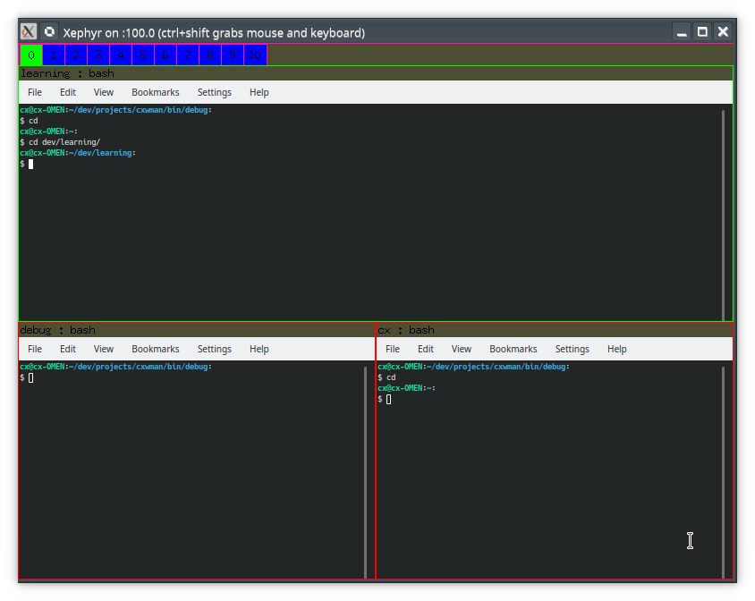

# CXWindowManager

## Todo's (features and questions)
1. Setup specific key & key combos for window manager actions such as:
   - [ ] Custom configuration
   - [ ] Implement EWMH stuff
        - [x] add client names as tags to our internal representation of windows
   - [ ] Font stuff
   - [ ] Basic graphics stuff, for example
        - [ ] Drawing a background
        - [ ] How does pixmaps work?
   - [ ] Logging of various X information (perhaps glance at basic_wm?)
   - [ ] Implement some form of [docking container](#docking-container) window, that will contain clickable widgets, for instance "go to workspace x"
   
### User action features
   - [x] Rotate window left/right
   - [x] Rotate layout in client tile-pair
   - [x] Move window left/right
   - [x] Move window up/down
   - [x] Teleport window to (implementation done, user functionality not yet done)
   - [ ] Kill client & application
   - [ ] Make window floating
   - [ ] Anchor tree to window (make it tiled)
   - [x] Resize tiled window
   - [ ] Resize floating window (easy.. Just tell X to resize, since we don't care how or where it ends up)
   - [ ] Make a run command user input window (described under section ["User command input window"](#user-command-input-window))
### User command input window

#### Feature ideas
   - Input box, which can translate user input to commands currently bound to global key-combos
   - Execute shell commands 

### Docking container
Similar to that of windows or linux. Containing things like what workspace one is on, or showing sys applets etc. 
Simple stuff to begin with.

## Todo's implementation details
   - [x] Grab WM Hints and WM atoms etc. Can we get client names, so we can use them as identifiers?
   
### How to implement

##### Handling event functions that take parameters 
As it is right now, key press events are handled by KeyEventHandler, defined in manager.hpp. This is done by keeping
a std::map of KeyConfiguration->Pointer-To-Member-Functions. These however, take no parameters. So how to solve this issue?
I don't want an enormous if-then-else wall.

I guess one way to solve it, would be that before an action is handled by KeyEventHandler, parameters can be registered
*with* the KeyEventHandler (from Manager), that then calls the pointer to member function (which is a ptm in Manager) that 
takes no parameters, which then accesses the registered parameters from KeyEventHandler (KeyEventHandler as it is, is a local 
struct of Manager.)

There are so many things that are totally hack-n-slash right now as far as the design goes, but it's just to get things up
and running, and frankly, I don't know any better as of right now.

There could be better solutions and designs here, but for now, this is what I got. 

#### Screenshot of current basic functionalities
